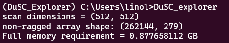

# DuSC Explorer Tutorial

The graphical user interface (GUI) can be opened in several ways:

* From a terminal, type in DuSC_explorer and press enter.
* Launch a python interpreter:
```python
>>> import DuSC_explorer
>>> DuSC_explorer.open_file()
```
* From a terminal in the DuSC_explorer directory:
```bash
$ python run_DuSC_explorer
```

A pop-up window will then prompt you to load the sparse 4D-STEM dataset from a stempy HDF5 file.


After the selected file is loaded, the program takes the compressed HDF5 file and partially expands it from sparse data to a "non-ragged array" whose size is printed in the command-line output. 3 versions of this array are produced to improve performance.



Always check to ensure that this expansion does not take up too much of your computer’s RAM. In this example (scanning nanobeam electron diffraction on a molecular crystal), the non-ragged array size is only around 0.3 GB leading to ~1GB of full RAM required, which is relatively lightweight. For other types of 4D-STEM datasets, however, this value can easily exceed 10 GB, which will render operation of the GUI very slow if your RAM is insufficient.


After the GUI loads the dataset, you’ll see two interactive windows: a virtual dark-field image (real space) on the left, and a diffraction pattern (reciprocal space) on the right. The two boxes correspond to customizable real-space and reciprocal-space virtual apertures. Use the rhombus-shaped handles in the bottom right corners of the two boxes to adjust their dimensions. To adjust their positions, click in the middle and drag.

For example, we can elongate the real-space virtual aperture into a rectangular shape to better capture more of the crystal, giving us many more Bragg reflections:


To visualize the coherently diffracting zone which produced a given Bragg reflection in this diffraction pattern, we can place a small reciprocal-space virtual aperture around a single peak.


The numerical values in the bottom left correspond to the sizes of the virtual apertures. For instance, in this case, we see `Diffraction: (330, 383), (24, 24)`. This means that the dimensions of our reciprocal-space virtual aperture correspond to a 24 by 24 pixel box whose top left corner has pixel coordinates (330, 383). Any type of square or rectangular virtual aperture is supported.

Under the `Display` drop-down menu, you’ll see two options:

1.	`Set colormap` lets you choose between 7 supported colormaps (viridis, inferno, plasma, magma, cividis, CET-C5, and CET-C5s).

2.	`Toggle log(diffraction)` effectively lets you expand and compress the dynamic range of the pixels in the diffraction pattern. To enhance visibility, log(diffraction) is always on by default.

Under the `Export` drop-down menu, you’ll see three options:

1.	`Export diffraction (TIF)` writes the raw data associated with the displayed diffraction pattern as a 32-bit TIF file. Each pixel value in this file is calibrated in units of electrons. (This choice of bit depth ensures no loss of information, but it also means you cannot view the resultant TIF files in normal image software meant for browsing vacation photos. Use DigitalMicrograph or ImageJ or FIJI instead.)

2.	`Export diffraction (SMV)` takes exactly what you’re seeing in the reciprocal-space window and writes the data as an SMV file suitable for programs developed for X-ray crystallography (e.g. Adxv, XDS, DIALS). If this option is selected, a pop-up window will prompt you to enter the correct metadata, which is then written directly into the 512-byte header of the SMV file.


3.	`Export real (TIF)` writes the raw data associated with the displayed virtual dark-field image as a 32-bit TIF file. Each pixel value in this file is calibrated in units of electrons.
